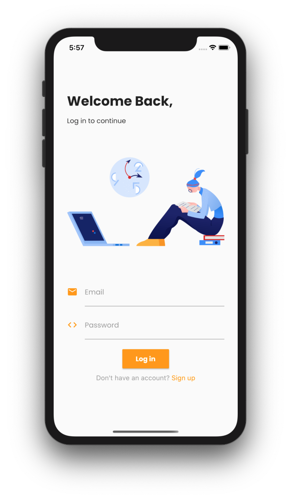
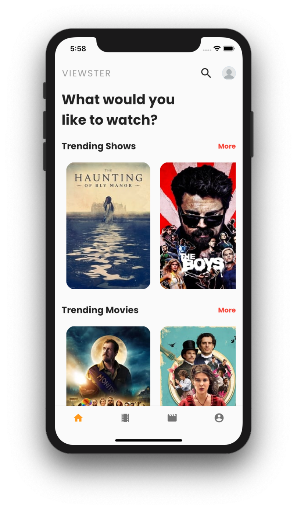
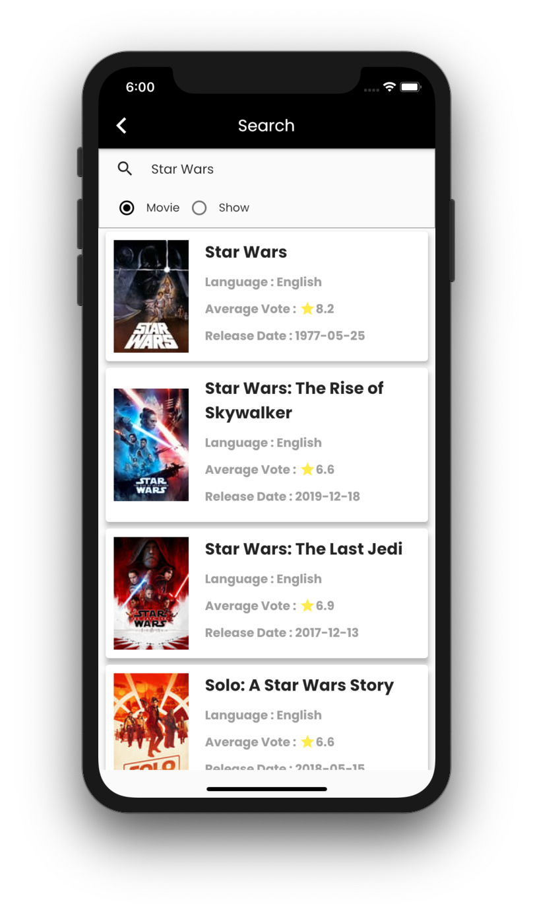
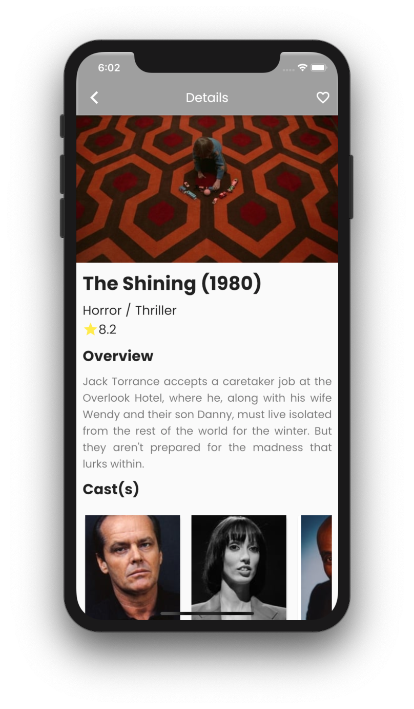
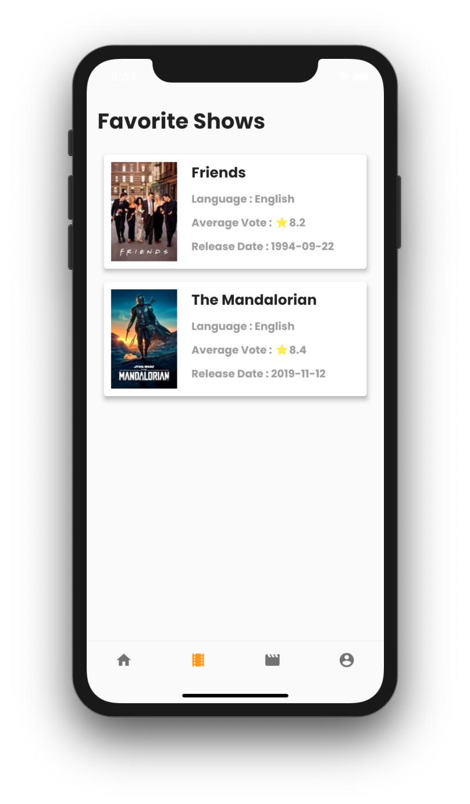

# Viewster

## Screenshot

  
  
  
  
  

## Overview

Viewster is an app which shows information regarding any Tv Show/ Movie. The user is required to signup into the application before using it. The app uses Firebase as a backend and incorporates Firebase Auth for authentication and Firebase Firestore for data persistence. Browse through the list of all the movies and tv shows and favorite the ones you like. The app incorporates:

- Flutter
- Tmdb API
- Provider
- Flutter Spinkit
- Firebase

## Getting Started

> This app is not available on the App Store.

This project is a starting point for a Flutter application.

A few resources to get you started if this is your first Flutter project:

- [Lab: Write your first Flutter app](https://flutter.dev/docs/get-started/codelab)
- [Cookbook: Useful Flutter samples](https://flutter.dev/docs/cookbook)

For help getting started with Flutter, view our
[online documentation](https://flutter.dev/docs), which offers tutorials,
samples, guidance on mobile development, and a full API reference.
